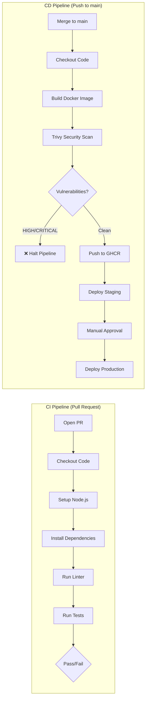

# 🚀 Automated CI/CD Pipeline with GitHub Actions, Docker & Trivy

[](https://github.com/raghavendra2006/Automated-CI-CD-Pipeline-with-GitHub-Actions-Docker-and-Trivy/actions/workflows/ci-cd.yml)

A production-ready CI/CD pipeline that automates **testing**, **security scanning**, **container building**, and **deployment** using GitHub Actions, multi-stage Docker builds, and Trivy vulnerability scanning.

---

## 📋 Table of Contents

- [Architecture Overview](#architecture-overview)
- [Pipeline Flow](#pipeline-flow)
- [Project Structure](#project-structure)
- [Technology Stack](#technology-stack)
- [Getting Started](#getting-started)
- [Pipeline Stages](#pipeline-stages)
  - [Continuous Integration (CI)](#continuous-integration-ci)
  - [Continuous Deployment (CD)](#continuous-deployment-cd)
- [Multi-Stage Docker Build](#multi-stage-docker-build)
- [Security Scanning with Trivy](#security-scanning-with-trivy)
- [GitHub Environments & Manual Approval Gate](#github-environments--manual-approval-gate)
- [Secrets Management](#secrets-management)
- [Triggering the Pipelines](#triggering-the-pipelines)
- [Trivy Ignore File](#trivy-ignore-file)
- [FAQ](#faq)

---

## Architecture Overview

This pipeline implements a modern DevSecOps workflow with two distinct phases:

```
┌─────────────────────────────────────────────────────────────────────┐
│                    CI Phase (Pull Request)                          │
│                                                                     │
│   Developer → Open PR → Checkout → Install Deps → Lint → Test      │
│                              ↓                                      │
│                     PR Status Check (Pass/Fail)                     │
└─────────────────────────────────────────────────────────────────────┘

┌─────────────────────────────────────────────────────────────────────┐
│                    CD Phase (Merge to main)                         │
│                                                                     │
│   Merge → Checkout → Build Docker Image → Trivy Scan               │
│                                              ↓                      │
│                    ┌──────── FAIL → Halt Pipeline                   │
│                    │                                                │
│                  PASS → Push to GHCR → Deploy Staging               │
│                                            ↓                        │
│                                   Manual Approval Gate              │
│                                            ↓                        │
│                                   Deploy Production                 │
└─────────────────────────────────────────────────────────────────────┘
```

### Why This Architecture?

| Principle | Description |
|---|---|
| **Shift-Left Testing** | Tests and linting run on PRs to catch bugs before merge |
| **Immutable Artifacts** | Docker image is built once, then scanned, pushed, and deployed — never rebuilt |
| **Security First** | Trivy scan happens before the image reaches the registry or any environment |
| **Controlled Rollouts** | Staging deploys automatically; production requires human approval |

---

## Pipeline Flow



---

## Project Structure

```
ci-cd-project/
├── .github/
│   └── workflows/
│       └── ci-cd.yml          # Complete pipeline definition
├── src/
│   ├── app.js                 # Express application logic
│   └── index.js               # Server entry point
├── tests/
│   └── app.test.js            # Supertest API tests
├── .dockerignore              # Docker build context exclusions
├── .eslintrc.json             # ESLint configuration
├── .gitignore                 # Git exclusions
├── .trivyignore               # Trivy CVE ignore list
├── Dockerfile                 # Multi-stage container build
├── package.json               # Node.js dependencies & scripts
├── package-lock.json          # Dependency lockfile
└── README.md                  # This documentation
```

---

## Technology Stack

| Tool | Purpose |
|---|---|
| **Node.js + Express** | Application runtime and API framework |
| **Helmet** | HTTP security headers middleware |
| **Jest + Supertest** | Unit testing and HTTP endpoint testing |
| **ESLint** | Static code analysis and linting |
| **Docker** | Containerization with multi-stage builds |
| **GitHub Actions** | CI/CD automation platform |
| **Trivy** | Container vulnerability scanning (DevSecOps) |
| **GHCR** | GitHub Container Registry for image storage |

---

## Getting Started

### Prerequisites

- [Node.js 18+](https://nodejs.org/)
- [Docker](https://www.docker.com/)
- [Git](https://git-scm.com/)
- A GitHub account with a public repository

### Local Setup

```bash
# Clone the repository
git clone https://github.com/raghavendra2006/Automated-CI-CD-Pipeline-with-GitHub-Actions-Docker-and-Trivy.git
cd Automated-CI-CD-Pipeline-with-GitHub-Actions-Docker-and-Trivy

# Install dependencies
npm ci

# Run tests
npm test

# Run linter
npm run lint

# Start the application
npm start
```

### Local Docker Build

```bash
# Build the Docker image
docker build -t my-app:latest .

# Run the container
docker run -p 3000:3000 my-app:latest

# Test the health endpoint
curl http://localhost:3000/health
```

---

## Pipeline Stages

### Continuous Integration (CI)

**Trigger:** Pull Request opened or updated against `main`

The CI pipeline validates code quality before merge:

| Step | Action | Tool |
|---|---|---|
| 1 | Checkout source code | `actions/checkout@v3` |
| 2 | Setup Node.js with npm caching | `actions/setup-node@v3` |
| 3 | Install dependencies deterministically | `npm ci` |
| 4 | Run code linter | `npm run lint` |
| 5 | Execute test suite | `npm test` |

> **Note:** The CI job uses `npm ci` instead of `npm install` to ensure deterministic, reproducible builds by installing exactly what's defined in `package-lock.json`.

### Continuous Deployment (CD)

**Trigger:** Code pushed/merged to `main`

The CD pipeline consists of three sequential jobs:

#### Job 1: `build-and-scan`
- Builds a Docker image tagged with the Git commit SHA
- Scans with Trivy for HIGH/CRITICAL vulnerabilities
- Pushes the verified image to GitHub Container Registry (GHCR)

#### Job 2: `deploy-staging`
- Automatically deploys the verified image to the staging environment
- Depends on successful completion of `build-and-scan`

#### Job 3: `deploy-production`
- Pauses for manual approval via GitHub Environments protection rules
- Deploys to production only after a reviewer approves
- Depends on successful completion of `deploy-staging`

---

## Multi-Stage Docker Build

The Dockerfile uses a **multi-stage build** strategy to produce a secure, minimal production image:

```dockerfile
# STAGE 1: Builder — installs ALL dependencies (including devDependencies)
FROM node:18-alpine AS builder
WORKDIR /app
RUN apk update && apk upgrade --no-cache
COPY package*.json ./
RUN npm ci
COPY src/ ./src/

# STAGE 2: Production — only production dependencies + compiled artifacts
FROM node:18-alpine AS production
RUN apk update && apk upgrade --no-cache
ENV NODE_ENV=production
WORKDIR /app
COPY package*.json ./
RUN npm ci --only=production
# Remove npm/npx to eliminate internal CVEs and reduce attack surface
RUN rm -rf /usr/local/lib/node_modules/npm /usr/local/bin/npm /usr/local/bin/npx
COPY --from=builder /app/src ./src

# Run as non-root user
RUN addgroup -S appgroup && adduser -S appuser -G appgroup
RUN chown -R appuser:appgroup /app
USER appuser
CMD ["node", "src/index.js"]

# Built-in health check for container orchestrators
HEALTHCHECK --interval=30s --timeout=5s --start-period=10s --retries=3 \
  CMD wget -qO- http://localhost:3000/health || exit 1
```

### Why Multi-Stage?

| Benefit | Description |
|---|---|
| **Smaller Image** | Final image excludes dev dependencies, test frameworks, and build tools |
| **Reduced Attack Surface** | npm/npx stripped from production image, eliminating internal CVE noise |
| **Layer Caching** | `package.json` is copied before source code, so dependency layers are cached |
| **Non-Root User** | The app runs as `appuser`, not root, following security best practices |
| **OS Patching** | `apk upgrade` ensures Alpine packages (OpenSSL, etc.) are up to date |
| **Health Check** | Built-in `HEALTHCHECK` allows Docker/Kubernetes to auto-restart unhealthy containers |

---

## Security Scanning with Trivy

[Trivy](https://github.com/aquasecurity/trivy) is an open-source vulnerability scanner by Aqua Security. It inspects Docker image layers against a database of known CVEs.

### Configuration in the Pipeline

```yaml
- name: Run Trivy Vulnerability Scanner
  uses: aquasecurity/trivy-action@0.35.0
  with:
    image-ref: 'my-app:${{ steps.vars.outputs.tag }}'
    format: 'table'
    exit-code: '1'          # Fail the build if vulnerabilities found
    ignore-unfixed: true     # Skip CVEs with no available fix
    vuln-type: 'os,library'  # Scan both OS packages and app libraries
    severity: 'HIGH,CRITICAL' # Only flag HIGH and CRITICAL severity
    trivyignores: '.trivyignore'  # Skip documented/risk-accepted CVEs
```

### Security Gate

Setting `exit-code: '1'` ensures the pipeline **halts immediately** if HIGH or CRITICAL vulnerabilities are detected. The image will **not** be pushed to GHCR or deployed to any environment.

---

## GitHub Environments & Manual Approval Gate

### Configuring the Production Approval Gate

1. Navigate to your repository on GitHub
2. Go to **Settings** → **Environments**
3. Click **New environment** and name it `production`
4. Click **Configure environment**
5. Check **Required reviewers**
6. Add your GitHub username as a required reviewer
7. Click **Save protection rules**

Similarly, create a `staging` environment (no protection rules needed).

### How It Works

When the CD pipeline runs:

1. `build-and-scan` → Builds, scans, and pushes the image ✅
2. `deploy-staging` → Deploys automatically to staging ✅
3. `deploy-production` → **Pauses** and enters a "Waiting" state ⏸️

A reviewer receives a notification (email + GitHub UI) to:
- Review the staging deployment
- **Approve** or **Reject** the production deployment

Only after approval does the `deploy-production` job execute.

---

## Secrets Management

### Built-in Secrets

| Secret | Source | Usage |
|---|---|---|
| `GITHUB_TOKEN` | Auto-injected by GitHub | GHCR authentication |
| `github.actor` | Auto-injected by GitHub | GHCR username |

### Adding External Secrets

For real-world integrations (AWS, Docker Hub, etc.):

1. Go to **Settings** → **Secrets and variables** → **Actions**
2. Click **New repository secret**
3. Name and store the secret
4. Reference in workflows: `${{ secrets.SECRET_NAME }}`

> ⚠️ **Never hardcode API keys or passwords in workflow files or source code.** GitHub Actions automatically redacts recognized secrets from execution logs.

---

## Triggering the Pipelines

### Trigger CI Pipeline (Testing & Linting)

```bash
# Create a feature branch
git checkout -b feature/my-new-feature

# Make changes and commit
git add .
git commit -m "feat: add new feature"

# Push and open a Pull Request
git push origin feature/my-new-feature
# Then open a PR to main on GitHub
```

### Trigger CD Pipeline (Build, Scan, Deploy)

```bash
# Merge the approved PR into main (via GitHub UI)
# OR push directly to main
git checkout main
git merge feature/my-new-feature
git push origin main
```

The CD pipeline will:
1. ✅ Build the Docker image (tagged with commit SHA)
2. ✅ Scan with Trivy
3. ✅ Push to GHCR
4. ✅ Deploy to Staging
5. ⏸️ Wait for manual approval
6. ✅ Deploy to Production (after approval)

---

## Trivy Ignore File

The `.trivyignore` file allows bypassing specific CVEs that:

- Exist in the base OS image (`node:18-alpine`) with **no upstream fix available**
- Are **false positives** for our application's use case
- Have been **risk-assessed** and deemed acceptable

### Usage

Add the CVE ID to `.trivyignore`, one per line:

```
# Base image vulnerability - no fix available upstream
CVE-2023-XXXXX
```

> **Best Practice:** Always document *why* each CVE is ignored and review the file periodically to remove entries once fixes become available.

---

## FAQ

**Q: Why does the pipeline fail on the "Run Linter" step?**
> ESLint may throw errors on formatting. The `--no-error-on-unmatched-pattern` flag is included in the lint script. If ESLint rules are too strict, adjust `.eslintrc.json` accordingly.

**Q: Trivy fails due to base image vulnerabilities I can't fix. What do I do?**
> Add the specific CVE ID to the `.trivyignore` file. Alternatively, update the base image to a newer patch version (e.g., `node:18.17-alpine`).

**Q: My `docker push` fails with "403 Forbidden".**
> Ensure the `permissions: packages: write` block is at the top of your workflow file. Also check **Settings → Actions → General → Workflow permissions** is set to "Read and write."

**Q: Why use `npm ci` instead of `npm install`?**
> `npm ci` performs a clean install from `package-lock.json`, ensuring 100% deterministic builds. It deletes existing `node_modules` and installs exact versions.

**Q: Can I test GitHub Actions locally?**
> Yes! Use [act](https://github.com/nektos/act) to run workflows locally with Docker.

---

## API Endpoints

| Method | Endpoint | Description |
|---|---|---|
| `GET` | `/health` | Health check — returns `{ status: 'UP', message: 'Service is healthy' }` |
| `GET` | `/api/data` | Sample data — returns `{ data: ['item1', 'item2'] }` |
| `GET` | `/api/version` | Version info — returns `{ version: '1.0.0', name: 'ci-cd-pipeline-app' }` |

---

## License

This project is licensed under the MIT License.